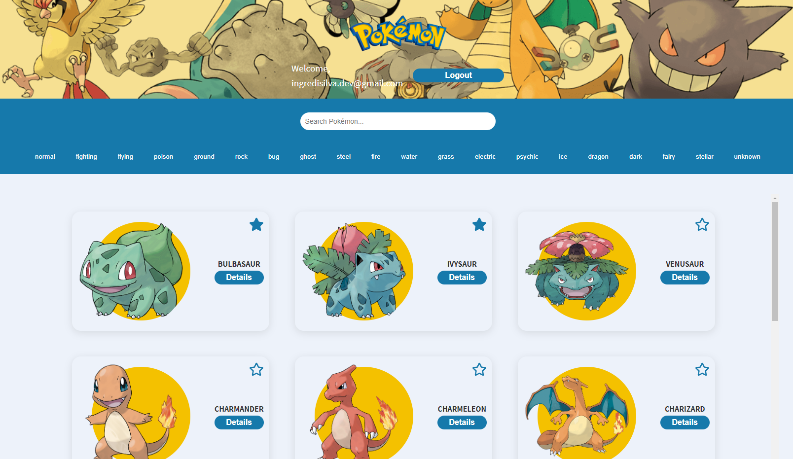

Installation and Setup

Clone the repository:

git clone [<repository-url>](https://github.com/ingredisilva/mypokemons.git)

Install dependencies:

yarn install

Start the application:

Features Implemented

1. User Authentication

Login by Email + Password: Users can log in with an email and password. The API validation is mocked, ensuring simplicity during testing and local development.

Mocked Login: We used a mocked API that stores the credentials in the browser's local storage to simulate the authentication process.

2. Pokémon List

Main Page with Pokémon List: The main page lists Pokémon fetched from the PokéAPI.

Lazy Loading: The list is initially limited, and more Pokémon can be loaded dynamically by clicking a "Load More" button.

Caching Pokémon Data: The Pokémon data is cached for improved performance, reducing API calls when filtering or interacting with the list.

3. Pokémon Search and Filters

Search Functionality: Users can search for Pokémon by name, which updates the list dynamically.

Filter by Type: Users can filter the Pokémon list by type, using the types retrieved from the PokéAPI.

Dynamic Type Buttons: The types are dynamically generated, and a selected type will change color to indicate the active filter.

4. Favorites System

Favorite Pokémon Selection: Users can mark Pokémon as favorites by clicking a star button on the Pokémon card.

Favorites Persistence: The favorite Pokémon list is saved to the browser's local storage, allowing it to persist between page reloads and browser sessions.

Favorites Page: A dedicated page displays all favorite Pokémon, making it easy for users to access their favorite creatures.

5. Pokémon Details

Details Modal: Clicking the "Details" button on a Pokémon card opens a modal that displays detailed information about that Pokémon, including abilities, types, and stats.

Stat Visualization: Pokémon stats are visualized using bars, providing a clear and easy-to-understand representation of each stat.

6. Responsiveness and Accessibility

Responsive Design: The application is designed to be responsive, hiding large images (e.g., the hero image on the login page) on mobile devices for improved usability.

Accessible Components: All interactive components are equipped with appropriate ARIA labels and focus states to enhance accessibility.

7. Loading States and Optimizations

Loader Component: A loading spinner is displayed during data fetching, enhancing user experience while waiting for API responses.

Conditional Loading and Optimization: The application handles conditional rendering with efficient loading strategies, preventing unnecessary re-renders and improving performance.

8. Application Architecture

Component-based Architecture: The application follows a component-based structure, breaking down the UI into reusable parts (e.g., PokemonCard, Button, Loader, Modal).

Global State Management with Context API: The Favorites system uses the Context API, which allows for managing global state effectively without prop drilling.

Services and Hooks: The API requests are centralized in a services folder, while hooks like usePokemons help manage data fetching logic.

9. Code Quality Improvements

Reusable Utility Functions: Common functions, such as fetching Pokémon images, are centralized in utility files for improved reusability.

Clean File Structure: The project follows a clean file structure, with CSS, components, hooks, pages, and utilities organized logically to enhance maintainability.

##Technologies Used

React: For building the user interface.

React Router: For navigating between pages (login, main page, favorites).

PokéAPI: Used to fetch Pokémon data.

Context API: For managing global state, such as favorite Pokémon.

Local Storage: For storing user credentials and favorite Pokémon.

Webpack & Babel: For bundling and transpiling code.
